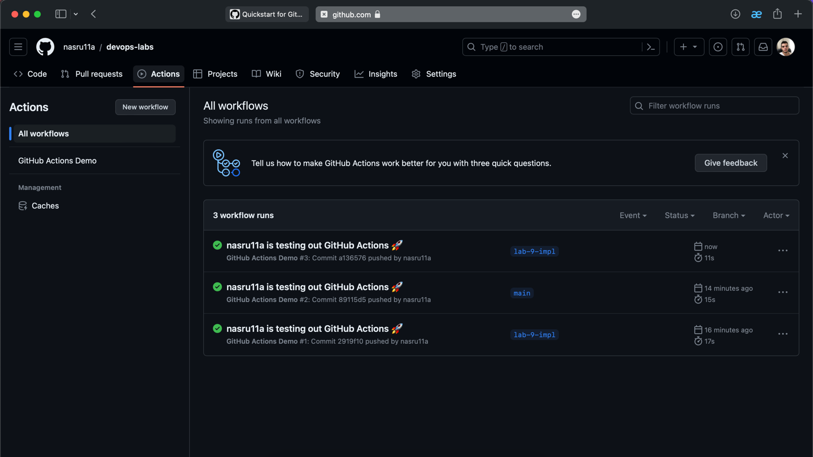

### 1. Step
Create a .github/workflows directory in your repository on GitHub if this directory does not already exist.

### 2. Step
In the .github/workflows directory, create a file named github-actions-demo.yml. For more information, see "Creating new files."

### 3. Step
Copy the following YAML contents into the github-actions-demo.yml file:
    
    name: GitHub Actions Demo
    run-name: ${{ github.actor }} is testing out GitHub Actions 🚀
    on: [push]
    jobs:
        Explore-GitHub-Actions:
            runs-on: ubuntu-latest
        steps:
            - run: echo "🎉 The job was automatically triggered by a ${{ github.event_name }} event."
            - run: echo "🐧 This job is now running on a ${{ runner.os }} server hosted by GitHub!"
            - run: echo "🔎 The name of your branch is ${{ github.ref }} and your repository is ${{ github.repository }}."
            - name: Check out repository code
            uses: actions/checkout@v3
            - run: echo "💡 The ${{ github.repository }} repository has been cloned to the runner."
            - run: echo "🖥️ The workflow is now ready to test your code on the runner."
            name: List files in the repository
            - run: |
                ls ${{ github.workspace }}
            run: echo "🍏 This job's status is ${{ job.status }}."

### Actions tab:
